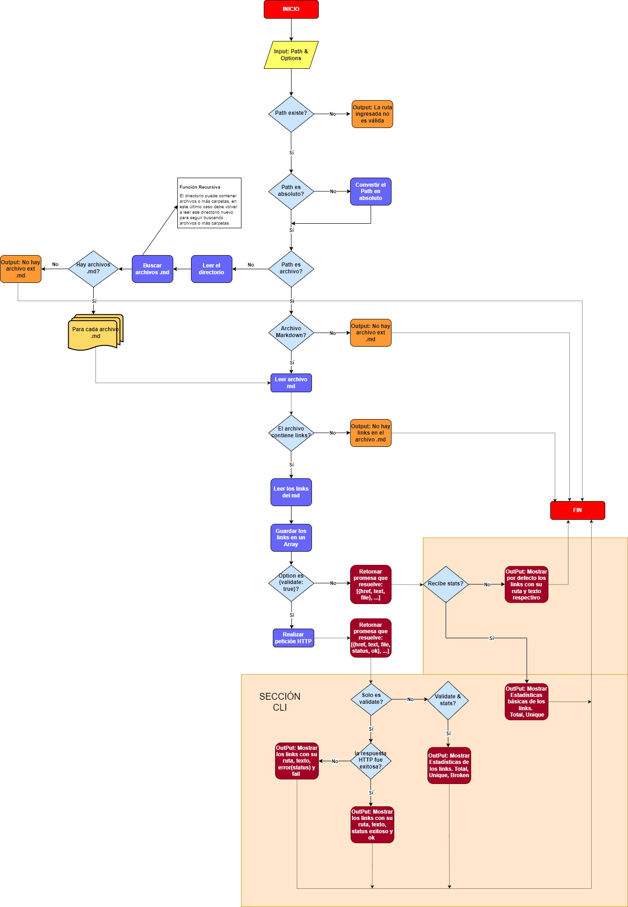
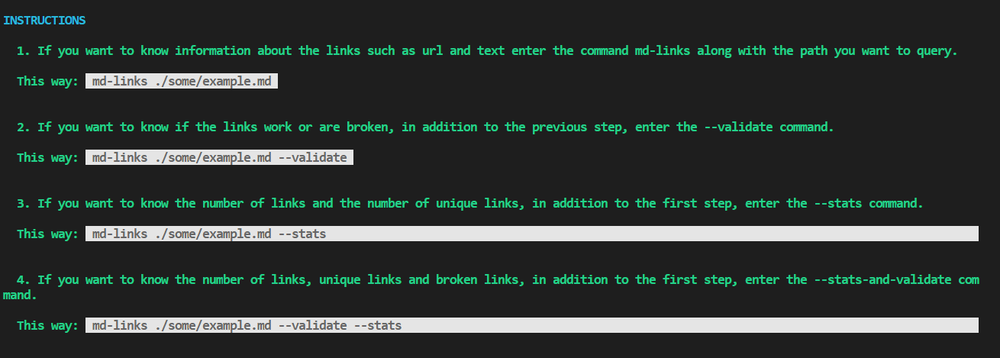

# Markdown Links

## 1. Preámbulo

[Markdown](https://es.wikipedia.org/wiki/Markdown) es un lenguaje de marcado
ligero muy popular entre developers. Es usado en muchísimas plataformas que
manejan texto plano (GitHub, foros, blogs, ...), y es muy común
encontrar varios archivos en ese formato en cualquier tipo de repositorio
(empezando por el tradicional `README.md`).

Estos archivos `Markdown` normalmente contienen _links_ (vínculos/ligas) que
muchas veces están rotos o ya no son válidos y eso perjudica mucho el valor de
la información que se quiere compartir.

## 2. MD-Links

MD-links es una biblioteca que mediante el uso de Node.js lee y analiza los archivos tipo Markdown; extrae los links contenidos en él para validarlos y mostar algunas estadísticas. MD-links está creado para ofrecer una interfaz (API) así como un ejecutable de linea de comandos (CLI).

## 3. Diagrama de Flujo

## 4. Instalación

    npm i md-links_stephanie

## 5. Guía de uso

### 5.1 Javascript API    

    
La biblioteca se importa y usa de acuerdo al siguiente ejemplo

    const mdLinks = require("md-links_stephanie");

Las propiedades de los links que se obtienen son:

* `href`: URL encontrada.
* `text`: Texto que aparecía dentro del link.
* `file`: Ruta del archivo donde se encontró el link.

Si se realiza validación se muestran además las siguientes propiedades: 

* `status`: Código de respuesta HTTP.
* `ok`: Mensaje `fail` en caso de fallo u `ok` en caso de éxito.
#### 5.1.1 Cuando se ingresa una ruta de archivo

    mdLinks("./some/example.md")
    .then(links => {
    // => [{ href, text, file }, ...]
    }).catch(console.error);

#### 5.1.2 Cuando se ingresa una ruta de archivo y se realiza validación 

    mdLinks("./some/example.md", { validate: true })
    .then(links => {
    // => [{ href, text, file, status, ok }, ...]
    }).catch(console.error);

#### 5.1.3 Cuando se ingresa una ruta de directorio

    mdLinks("./some/dir")
    .then(links => {
    // => [{ href, text, file }, ...]
    }).catch(console.error);

### 5.2 CLI

- Si desea conocer las instrucciones, debe ingresar sólo el nombre del comando 

      $ md-links
  

- Para ejecutar md-links en la terminal, debe ingresarse de la siguiente manera:

      $ md-links <path-to-file> [options]

   `<path-to-file>`: ruta de archivo o directorio a verificar  

  `[options]`: pueden ser '--validate', '--stats' o '--stats --validate'; todo depende de lo que se quiera visualizar de los links...

- Si solo quiere conocer información básica sobre los links debe hacerlo de la siguiente manera:

       $ md-links ./some/example.md
      ./some/example.md http://algo.com/2/3/ Link a algo
      ./some/example.md https://otra-cosa.net/algun-doc.html algún doc
      ./some/example.md http://google.com/ Google

- Si desea validar cuales links funcionan y cuales no, debe hacerlo de la siguiente manera:

      $ md-links ./some/example.md --validate
      ./some/example.md http://algo.com/2/3/ ok 200 Link a algo
      ./some/example.md https://otra-cosa.net/algun-doc.html fail 404 algún doc
      ./some/example.md http://google.com/ ok 301 Google

- Si desea obtener estadísticas básicas sobre los links, debe hacerlo de la siguiente manera:

      $ md-links ./some/example.md --stats
      Total: 3
      Unique: 3

- Si además de la opción anterior desea saber cuantos links están rotos, debe hacerlo de la siguiente manera:

      $ md-links ./some/example.md --stats --validate
      Total: 3
      Unique: 3
      Broken: 1

